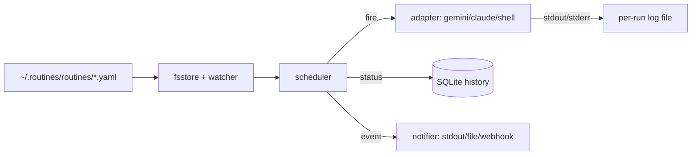

# agent-routines

Cron-like scheduler that runs agent CLIs (Gemini, Claude Code, generic
shell) on declarative YAML schedules.



## Install

```bash
go install github.com/ElodinLaarz/agent-routines/cmd/routines@latest
```

Pre-built binaries land via the release pipeline (see `init/` for service
files for systemd / launchd / Windows Task Scheduler).

## Quickstart

```bash
mkdir -p ~/.routines/routines
cp examples/routines/morning-triage.yaml ~/.routines/routines/

# (optional) put secrets in ~/.routines/env, never in YAML
cp examples/env.example ~/.routines/env
chmod 600 ~/.routines/env

# verify the spec parses
routines list

# run once, out-of-band
routines run morning-triage

# install as a managed service (Linux/macOS)
routines install-service
# Windows
powershell -ExecutionPolicy Bypass -File init\windows\install.ps1
```

## CLI

```
routines daemon                 # run scheduler in foreground
routines list                   # show routines, last status, next fire
routines run <name>             # fire one routine immediately
routines add <file.yaml>        # validate + install spec
routines enable|disable <name>  # toggle without editing YAML
routines logs <name> [-n N]     # print last N run logs
routines tail <name>            # follow current/next run output
routines install-service        # systemd (Linux) / launchd (macOS)
routines uninstall-service      # remove the service file
routines version
```

See [docs/quickstart.md](docs/quickstart.md), [docs/spec.md](docs/spec.md),
[docs/cli.md](docs/cli.md), and [docs/adapters/](docs/adapters/) for
details.

## Layout

```
cmd/routines/        # CLI + daemon entrypoint
internal/spec/       # YAML parsing, validation
internal/store/      # fsstore (specs) + history (SQLite)
internal/scheduler/  # cron loop, locks, retries
internal/adapter/    # agent adapter interface + impls
internal/notify/     # notifier interface + sinks
internal/log/        # per-run log writer
internal/daemoncfg/  # daemon config + env-file loader
init/                # systemd / launchd / Windows service files
examples/            # ready-to-edit specs and config
```

## Status

v0.1 in progress. Tracking epic: [#1](https://github.com/ElodinLaarz/agent-routines/issues/1).
